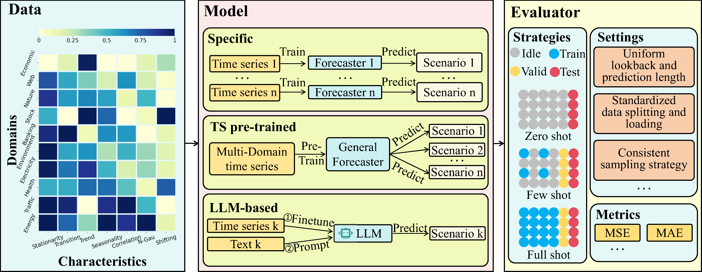

# TSFM-Bench: A COMPREHENSIVE AND UNIFIED BENCHMARKING OF FOUNDATION MODELS FOR TIME SERIES FORECASTING

## Introduction

Time Series Forecasting (TSF) is key functionality in numerous fields, such as financial investment, weather services, and energy management. Although increasingly capable TSF methods occur, many of them require domain-specific data collection and model training and do not generalize well when applied in other domains. Time Series Foundation Models (TSFMs) that are pre-trained on massive heterogeneous time series data aim to overcome these limitations. The prospects for generalizability have spurred the development of a new generation of TSFMs. This study proposes a benchmark, fewTSFM-Bench, to facilitate comprehensive and unified evaluation of TSFMs. fewTSFM-Bench covers a wide range of TSFMs, including those based on large language models and those pre-trained on time series data. fewTSFM-Bench supports multiple forecasting scenarios, including zero-shot, few-shot, and full-shot, enabling assessment across the full range of adaptation strategies. fewTSFM-Bench also provides a standardized experimental protocols for critical evaluation processes such as dataset splitting, loading, normalization, and few-shot sampling, facilitating consistency and fairness. We report on an extensive evaluation of TSFMs across a diverse range of datasets spanning multiple domains and exhibiting varied statistical characteristics. Specifically, we identify pros and cons and inherent limitations of existing TSFMs, and we propose potential directions for new model designs. fewTSFM-Bench is available at https://github.com/decisionintelligence/TSFM-Bench.

<div align="center">

</div>

## Quickstart

### Installation

1. Clone repository:
    ```shell
    git clone git@github.com:decisionintelligence/TSFM-Bench.git
    cd TSFM-Bench
    ```

2. Create virtual environment
    <!-- ```shell
    conda create -n "TSFM-Bench" python=3.10
    conda activate TSFM-Bench
    pip install -r requirements.txt
    ``` -->
    1. **Download the environment**

        Download the environment from [Link](https://pan.quark.cn/s/6a38b4d85e7d). (This may take some time, please wait patiently.) Then, create a directory my_env (we recommend creating it under `conda/envs/`) and extract the environment into this directory:
        ```shell
        mkdir -p my_env
        tar -xzf TSFM-Bench.tar.gz -C my_env
        ```
    2. **Activating the Environment**

        After extraction, you can activate the environment:

        - If you extracted the environment under `conda/envs/`, you can directly use the following command to activate it:
            ```bash
            conda activate my_env
            ```
        - If you extracted the environment under another directory, you can use the following command to activate it:
            ```bash
            conda activate /path/to/my_env
            ``` 
    <!-- 3. **Installing the Requirements**

        After activation, you can install the requirements:
        ```shell
        pip install -r requirements.txt
        ``` -->
    3. **Unpacking the Environment**

        The environment is packed into a single file. To use it, you need to unpack it first. You can unpack the environment using the following command:
        ```shell
        (my_env) $ conda-unpack
        ```
### Prepaer Datasets

You can obtained the well pre-processed datasets from [Google Drive](https://drive.google.com/file/d/1ZrDotV98JWCSfMaQ94XXd6vh0g27GIrB/view?usp=drive_link). Create a separate folder named `./dataset` 

### Prepaer Checkpoints for Foundation Models
1. We provide checkpoints for the basic model used in the paper. Please download the checkpoints from [Link](https://pan.quark.cn/s/42f9e31599c0).

2. You can also download the checkpoints from the following link. Please place the `checkpoint_llm` folder under `./ts_benchmark/baselines/LLM/` and rename it as `checkpoints`. the `checkpoint_pretrain` folder under `./ts_benchmark/baselines/pre_train/` and rename it as `checkpoints`.:

    | **Model** | **Link** |
    | --- | --- |
    | `Chronos` | [Huggingface](https://huggingface.co/amazon/chronos-bolt-base) |
    | `TimesFM` | [Huggingface](https://huggingface.co/google/timesfm-1.0-200m-pytorch) |
    | `Timer` | [Google Drive](https://drive.google.com/drive/folders/15oaiAl4OO5gFqZMJD2lOtX2fxHbpgcU8) |
    | `UniTS` | [Github](https://github.com/mims-harvard/UniTS/releases/tag/ckpt) |
    | `TinyTimeMixer` | [Huggingface](https://huggingface.co/ibm-research/ttm-research-r2) |
    | `Moment` | [Huggingface](https://huggingface.co/AutonLab/MOMENT-1-large) |
    | `MOIRAI` | [Huggingface](https://huggingface.co/Salesforce/moirai-1.0-R-base) |
    | `GPT-2` | [Huggingface](https://huggingface.co/openai-community/gpt2) |

3. Some model-specific requirements
When you want to test the CALF, please refer to the [link](ts_benchmark/baselines/LLM/submodules/CALF/get_woken.ipynb).
<!-- When you want to test the AutoTimes, please refer to the [link](ts_benchmark/baselines/LLM/submodules/AutoTimes/preprocess.ipynb). -->

### Train and evaluate model
- We provide the experiment scripts for all models under the folder `./scripts`. For example you can reproduce a experiment result as the following:

    ```shell
    # Zero-Shot
    sh ./scripts/pre_train_model/zero_shot/ETTh1_scripts/TTM.sh
    ```

- When you want to write your own script, please pay attention to changing the following values to meet different testing requirements: `is_train`, `sampling_rate`, `sampling_basis`, `sampling_strategy`.

    ```shell
    # "is_train" = 1, 0
    # "sampling_rate" = 0.05 (0~1)
    # "sampling_basis" = "sample", "data"
    # "sampling_strategy = "uniform", "random", "begin", "end"
    python ./scripts/run.py --config-path "rolling_forecast_config.json" --data-name-list "ETTh1.csv" --strategy-args '{"horizon":96}' --model-name "pre_train.UniTS" --model-hyper-params '{"horizon": 96, "seq_len": 512, "target_dim": 7, "dataset": "etth1", "is_train": 1, "freq": "h", "sampling_rate": 0.05, "sampling_strategy": "uniform", "sampling_basis": "sample"}' --adapter "PreTrain_adapter"  --gpus 0  --num-workers 1  --timeout 60000  --save-path "TEST"
    ```
